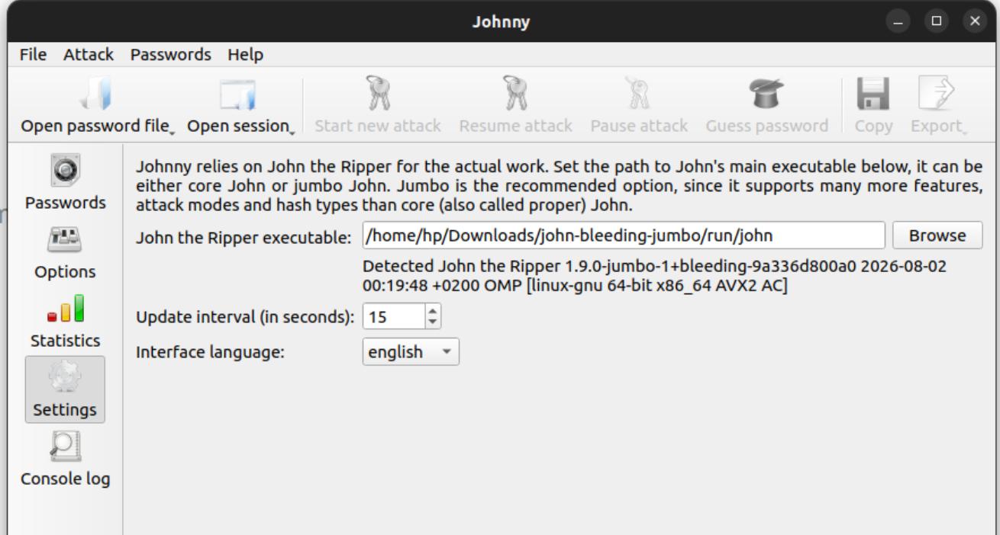
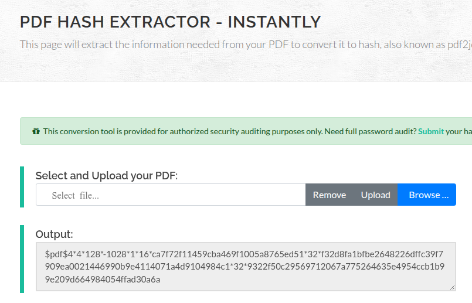
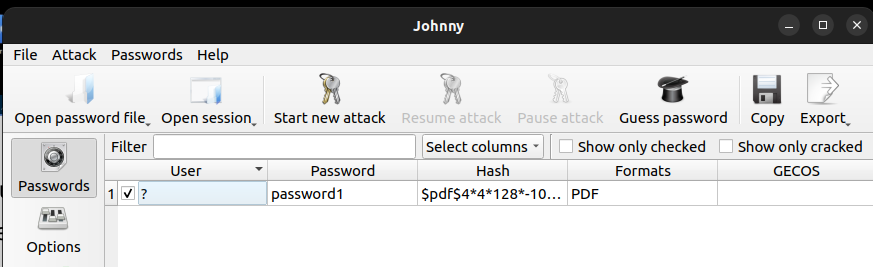
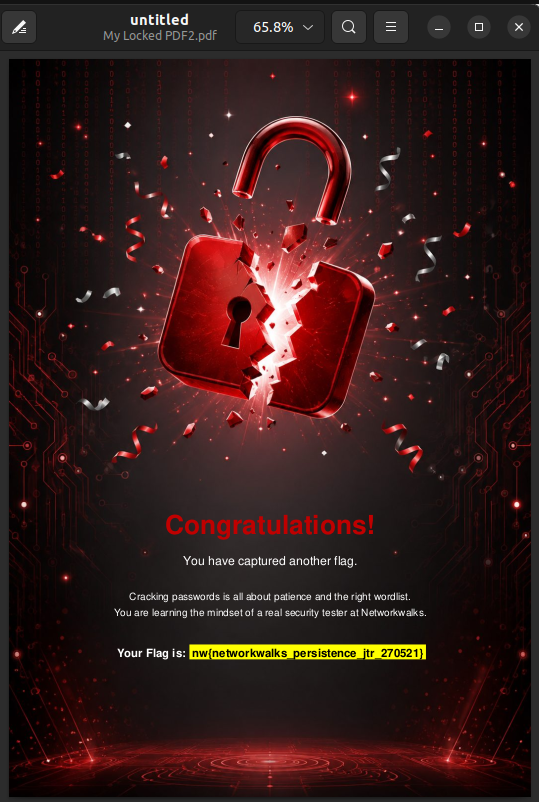
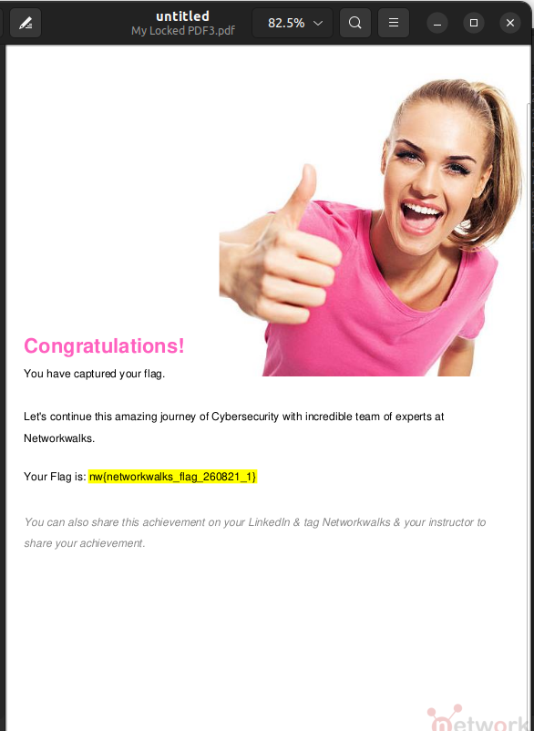
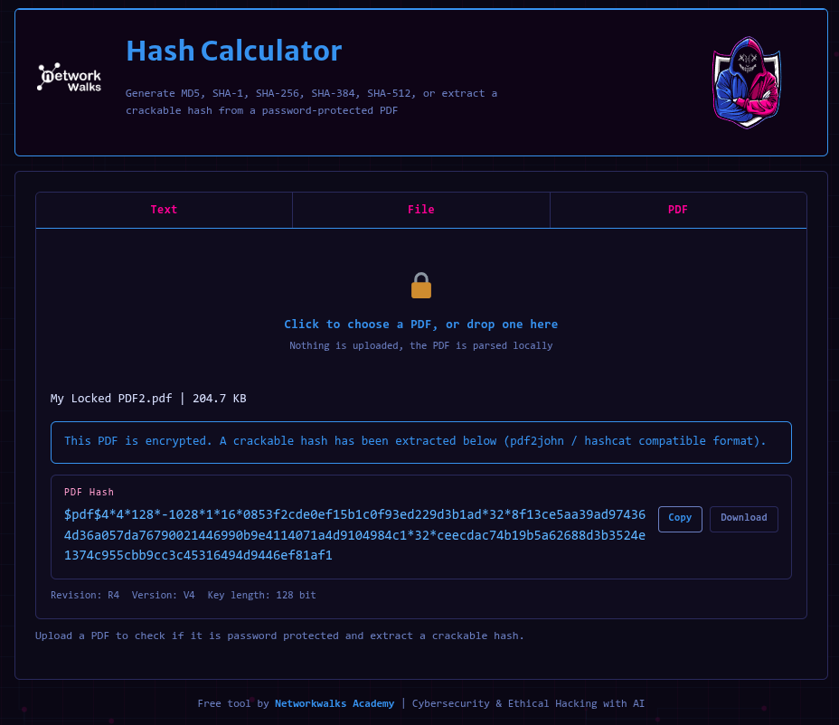
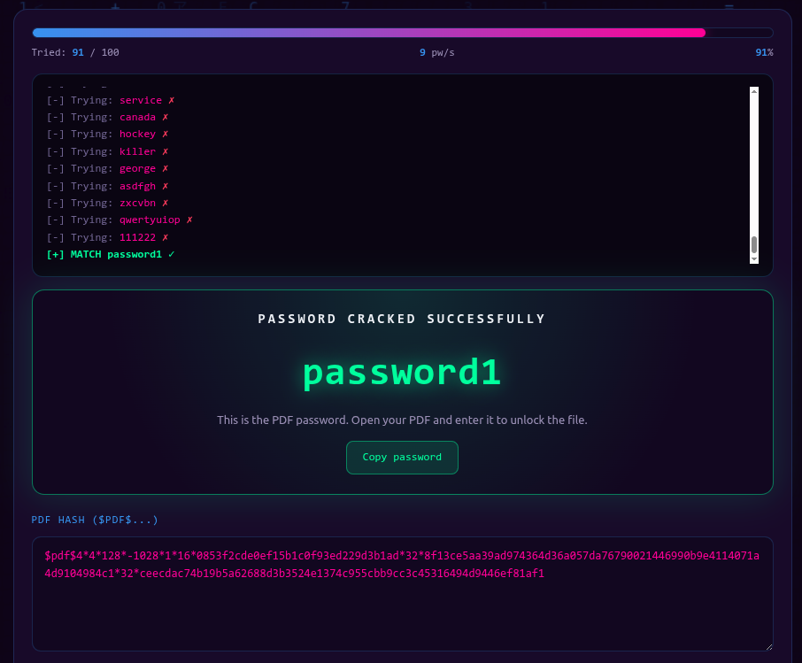
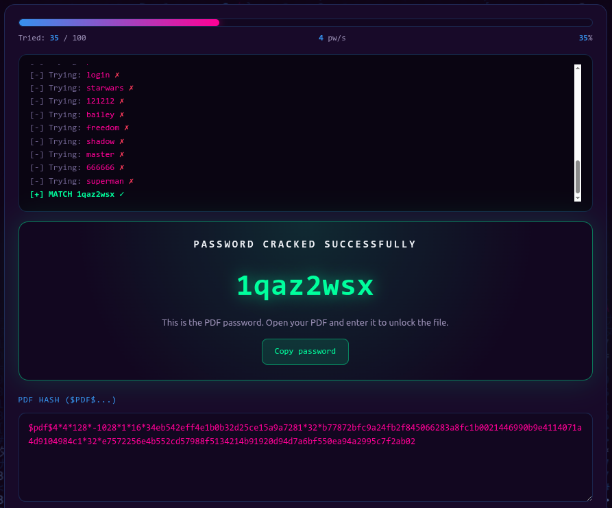

# 🔑 Password Cracking Labs

## Method1: Using JTR (John The Ripper)

Cracking the password of a PDF file using the JTR tool is a very straightforward process. After downloading JTR and installing Johnny (the GUI for JTR), we browse Johnny and use the path of the JTR executable, then open a file that contains the hash value of the PDF file.

For e.g. we can use this website to find the hash value of each PDF file:

[Onlin Hash Crack Tool](https://www.onlinehashcrack.com/tools-pdf-hash-extractor.php)

#### Hashes Values:
| PDF | Hash Value |
|-----|-------------|
| PDF-1 | $pdf$4*4*128*-1028*1*16*ca7f72f11459cba469f1005a8765ed51*32*f32d8fa1bfbe2648226dffc39f7909ea0021446990b9e4114071a4d9104984c1*32*9322f50c29569712067a775264635e4954ccb1b99e209d664984054ffad30a6a |
| PDF-2 | $pdf$4*4*128*-1028*1*16*0853f2cde0ef15b1c0f93ed229d3b1ad*32*8f13ce5aa39ad974364d36a057da76790021446990b9e4114071a4d9104984c1*32*ceecdac74b19b5a62688d3b3524e1374c955cbb9cc3c45316494d9446ef81af1 |
| PDF-3 | $pdf$4*4*128*-1028*1*16*34eb542eff4e1b0b32d25ce15a9a7281*32*b77872bfc9a24fb2f845066283a8fc1b0021446990b9e4114071a4d9104984c1*32*e7572256e4b552cd57988f5134214b91920d94d7a6bf550ea94a2995c7f2ab02 |

#### Finding passwords using Johnny/JTR:

#### Result (trying the passwords):

<table>
  <tr>
    <td></td>
    <td></td>
    <td></td>
  </tr>
</table>

---
## Method2: Using Networkwalks Tools
A much easier way is to directly use ready-to-use tools like the ones provided by Networkwalks (a hash calculator tool and a password checker tool).
#### Hash calculator: [networkwalks-hash-calculator](https://networkwalks.com/hash-calculator/)

Simply upload the pdf file and copy the hash value extracted.

<table>
  <tr>
    <td></td>
    <td></td>
    <td></td>
  </tr>
</table>

#### Password Cracker: [Networkwalks-password-cracker](https://networkwalks.com/password-cracker/)

Copy the hash of the target PDF file, and upload a worldlist text file (optional), and wait for cracking.

<table>
  <tr>
    <td></td>
    <td></td>
    <td></td>
  </tr>
</table>

---
